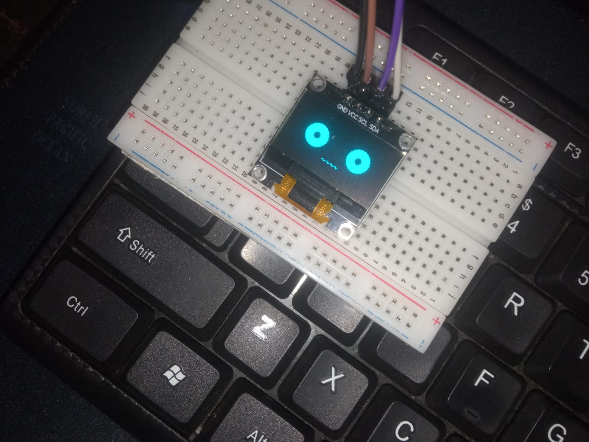

# Jarvis Physical V1

A desktop voice assistant with a physical OLED face built using **Python** and  **Arduino UNO** .

The assistant listens for voice commands, transcribes speech locally using Whisper, performs system automation, answers questions using a local LLM, and displays real-time expressions on an OLED display.

Created by  **Divyanshu Verma** , a  **Class 9 student** .

---

## Features

* Wake word activation
* Offline speech recognition using Faster Whisper
* Voice Activity Detection using Silero VAD
* Text-to-Speech responses
* Physical animated OLED face
* System automation
* Local AI conversation using Ollama
* Serial communication between Python and Arduino
* Command execution
* Continuous conversation mode

---

## Hardware

* Arduino UNO
* 0.96" SSD1306 OLED Display (I2C)
* USB Cable
* Computer running Python

---

## Software Stack

### Python

* faster-whisper
* silero-vad
* sounddevice
* numpy
* pyttsx3
* requests
* pyserial

### Arduino

* Adafruit GFX Library
* Adafruit SSD1306 Library
* Wire Library

---

## OLED Expressions

The OLED display changes its facial expression depending on Jarvis' current state.

| State     | Expression               |
| --------- | ------------------------ |
| Idle      | Calm face                |
| Listening | Waiting for speech       |
| Thinking  | Animated processing face |
| Speaking  | Talking animation        |

---

## Voice Commands

Examples include:

* Open Notepad
* Open Browser
* Open GitHub
* Open YouTube
* Open VS Code
* Open Linux (WSL)
* Shutdown Computer
* Cancel Shutdown

Any command that is not recognized is automatically sent to the local AI model.

---

## Project Structure

```
Jarvis/
│
├── jarvis1.1.py
├── arduino/
│   └── jarvis_face.ino
├── requirements.txt
├── LICENSE
├── README.md
└── .gitignore
```

---

## Installation

Clone the repository

```bash
git clone https://github.com/Python-devloper-student/Jarvis-Physical-V1.git
```

Install dependencies

```bash
pip install -r requirements.txt
```

Upload the Arduino sketch to the Arduino UNO.

Start Ollama and make sure your custom model is available.

Update the COM port if necessary.

Run

```bash
python jarvis.py
```

---

## How It Works

1. Jarvis waits for the wake word.
2. Voice is detected using Silero VAD.
3. Audio is transcribed locally using Faster Whisper.
4. If the command matches a predefined action, it is executed.
5. Otherwise, the request is sent to a local LLM through Ollama.
6. Responses are spoken aloud while the OLED face animates according to Jarvis' state.

---

## Future Improvements

* ESP32 wireless version
* Battery powered hardware
* Camera integration
* Face recognition
* Home automation
* Mobile control
* GUI dashboard
* Memory system
* Vision capabilities

---

## License

This project is licensed under the MIT License.

You are free to use, modify, and distribute this project, but proper credit to the original author is appreciated.

---

## Author

**Divyanshu Verma  a class 9 student from india**

GitHub:
[https://github.com/Python-devloper-student](https://github.com/Python-devloper-student)

Created as a personal learning project to explore embedded systems, AI, computer vision, and desktop automation.
